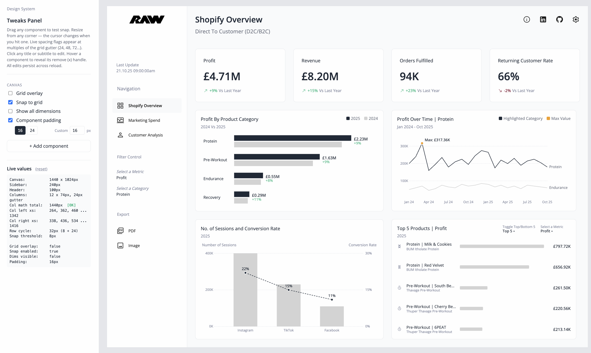
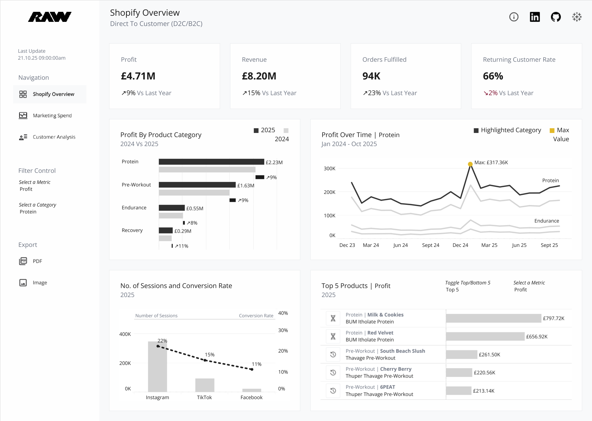
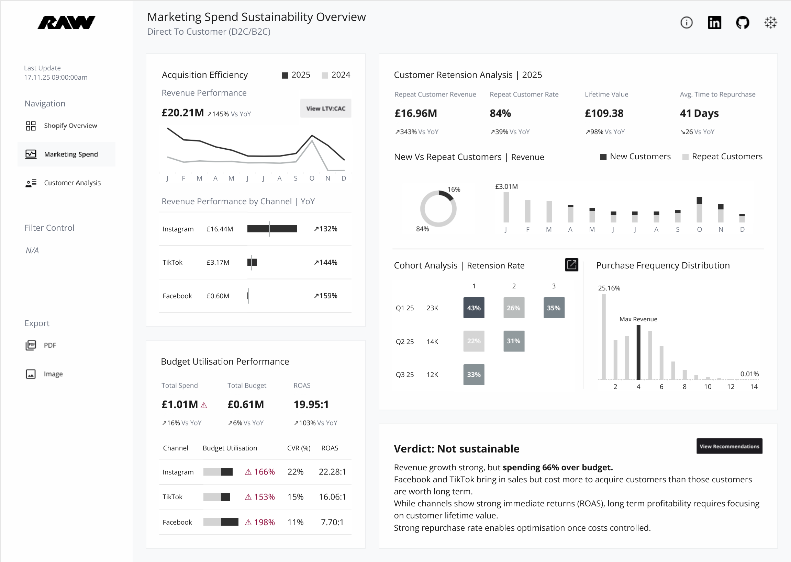

# Dashboard Design System

The goal is to ship a high-fidelity BI dashboard prototype in 30 minutes. For analysts and BI staff who want to save time and demo something realistic to a client. Use this as a starting point and tailor it to how you build dashboards and widgets.

## Status

I've only spent a couple of hours building this as a side project, as an alternative to Figma. Expect rough edges.

## Demo

## Reverse-engineered from

The kit was reverse-engineered from two of my own dashboards built in Tableau.

<table>
  <tr>
    <td>
      
       
      <a href="https://public.tableau.com/app/profile/valerie.madojemu/viz/ShopifyOverviewRAWNutritionConcept/ShopifyOverview" target="_blank" rel="noopener noreferrer">View Shopify Overview on Tableau Public</a>
    </td>
    <td>
      
       
      <a href="https://public.tableau.com/app/profile/valerie.madojemu/viz/MarketingSpendOverviewRAWNutritionConcept/MarketingSpendOverview" target="_blank" rel="noopener noreferrer">View Marketing Spend on Tableau Public</a>
    </td>
  </tr>
</table>

## Why this exists

Figma was my dashboard tool for years. I never invested deeply in learning it. Dashboarding is one slice of the job, alongside data modeling, prep, etc.

The pain points piled up:

- Charts are slow to mock up. Tables aren't native.
- No design system discipline. Copy-paste from the last dashboard each time.
- Borrowed graphs from the web broke my styling.
- Static mockups can't demo interaction. I'd describe how the prototype worked instead of showing it.

I wanted somewhere to mock up a wireframe, experiment, take inspiration from layouts and graphs on the web or other dashboards, and implement straight away.

## Getting Started

One design system, many projects. The kit is the starting point. Every new dashboard or widget builds from the same HTML, tokens, and components. You don't rebuild the foundation; you extend it.

1. **Watch Nate Herk's Claude Design masterclass.** It walks through the Cowork → Claude Design workflow this kit is built around. <a href="https://www.youtube.com/watch?v=ovabeVoWrA0" target="_blank" rel="noopener noreferrer">Watch on YouTube</a>.

2. **Download the kit.** Clone the repo or grab the zip from GitHub.

3. **Iterate in Claude Cowork (or equivalent).** Open the kit in Cowork, Claude Code, Codex, or another AI tool. Do the thinking there. Use <a href="prompts/get-started.md" target="_blank" rel="noopener noreferrer"><code>prompts/get-started.md</code></a> as your starting prompt — it walks the LLM through a checkpoint-driven adaptation. If you're basing your dashboard on something specific (a real dashboard, an inspiration image), upload reference pictures and tell it what to match.

4. **Move to Claude Design for the visual finish.** Set up the kit as a Design System inside Claude Design. You can paste the GitHub repo URL or drop the folder directly. From there, create a new project per dashboard or widget. The Design System stays fixed; each project is one instance.

### Why Cowork first, Claude Design second

- Claude Design has its own weekly quota, separate from your regular Claude usage.
- Burn through it on iteration and you're stuck for the week.
- Do the ideation, rough spec, and brainstorming in Cowork (or Claude chat / Claude Code).
- Move to Claude Design with a clear plan and let it focus on the visual finish.

## What is inside

| Path | What's in it |
|---|---|
| `template/` | The working dashboard. `index.html` plus CSS and JS. |
| `prompts/` | Starter prompt for LLMs to tailor the kit to your project. |
| `reference/charts/` | Five standalone chart files. |
| `reference/screenshots/` | The two reference dashboards shown above plus the full kit screenshot. |
| `assets/` | Logo and icons. |

## What's in v0.1.0

- **Canvas.** 1440x1024 fixed, with snap-to-grid, edge alignment guides, and live spacing flags at gutter multiples.
- **Components.** 4 KPI cards plus 4 chart types: grouped bar, multi-line with annotation, combo bar plus line, ranked horizontal bar.
- **Tweaks Panel.** Grid overlay, snap, dimensions, and component padding (16, 24, or custom) toggles. + Add component.
- **Named views.** Save, load, rename, duplicate, reset, drag-to-reorder. Edits auto-save into the active view. Stored in localStorage.
- **Default layout.** Save any layout as the default. New views and per-view reset start from it.

## Roadmap

Not yet built:

- Different sized dashboards (16:9, mobile, tablet). Kit is canvas-locked at 1440x1024 right now.
- Alternative grid systems (8-column or 16-column variants of the current 12-column).
- Alternative dashboard layouts.
- A way to change colors, fonts, and layout without touching the code.
- Claude Skills for chart-building and front-end work, so users can tailor the kit to their own stack.

## Credits

The technique I used to build this came from Nate Herk's <a href="https://www.youtube.com/watch?v=ovabeVoWrA0" target="_blank" rel="noopener noreferrer">Claude Design masterclass</a>.

## License

MIT.
